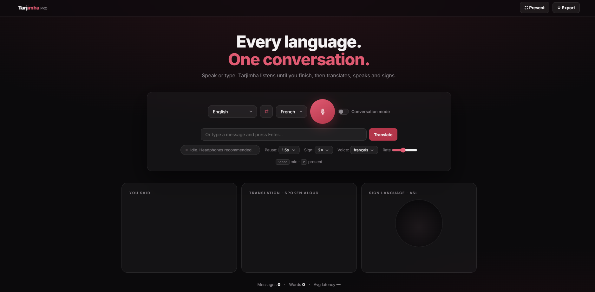
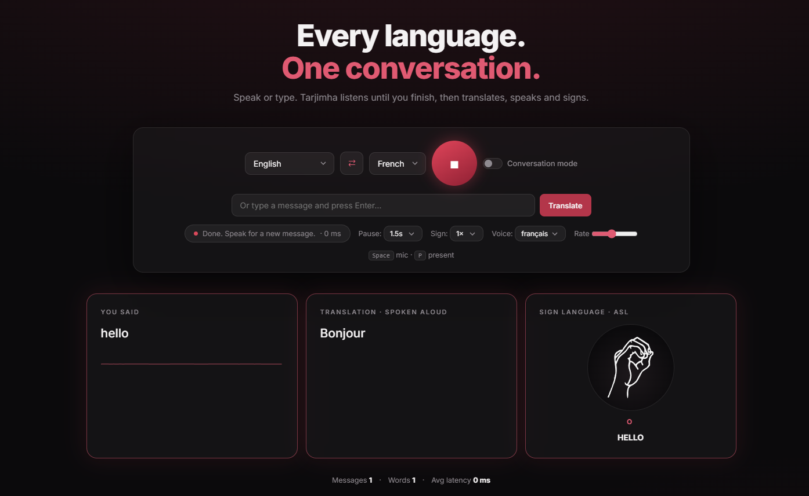
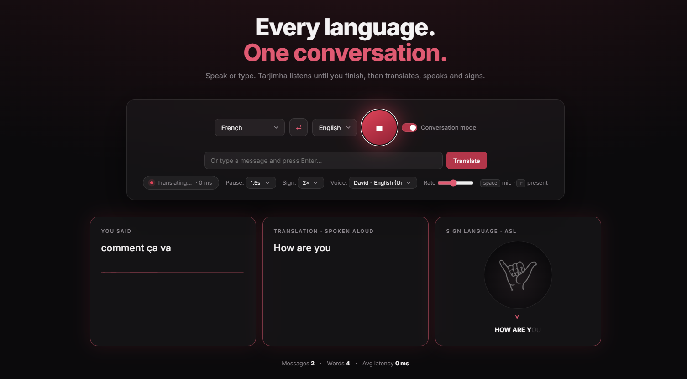
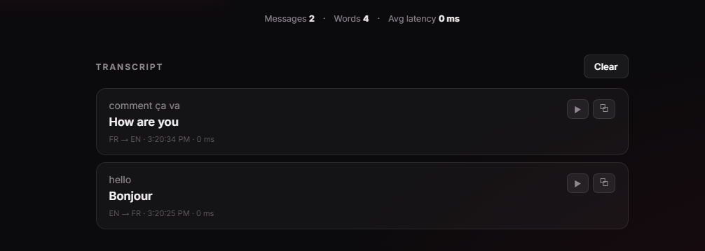

# Tarjimha

Tarjimha is a real-time voice and text translation web application that helps users communicate across languages.  
The app allows users to speak or type a message, translate it into another language, hear the translated result aloud, and view ASL fingerspelling support.

<p align="center">
  
</p>

---

## Live Demo

After enabling GitHub Pages, the project can be viewed here:

```text
https://Mohammad-AlJourishi.github.io/Tarjimha/
```

---

## Project Overview

Tarjimha is designed as an accessibility-focused communication tool.  
It combines speech recognition, text translation, text-to-speech, conversation mode, ASL visual support, and transcript history in one simple web interface.

Users can either speak using the microphone or type directly into the text box.  
The system then translates the message, speaks the result aloud, and displays sign language support using ASL fingerspelling.

---

## Screenshots

### Homepage Interface

<p align="center">
  
</p>

The homepage shows the main Tarjimha interface with language selection, microphone control, text input, voice settings, and translation panels.

---

### Sign Language Translation Demo

<p align="center">
  
</p>

This screenshot shows Tarjimha translating the word **“hello”** into French and displaying the ASL fingerspelling output.

---

### Conversation Mode and Text Translation

<p align="center">
  
</p>

This screenshot shows the conversation mode feature working with typed text input.  
The system translates the French phrase **“comment ça va”** into English as **“How are you”** and displays ASL support.

---

### Transcript History

<p align="center">
  
</p>

This screenshot shows the transcript history section, where previous translations are saved during the session.  
Users can review previous messages, replay spoken translations, and copy translated text.

---

## Features

- Real-time voice recognition
- Text-based translation input
- Speech-to-text support
- Text-to-speech output
- ASL fingerspelling display
- Conversation mode for two-person dialogue
- Language swap button
- Translation transcript history
- Replay translated speech
- Copy translated text
- Export transcript as a text file
- Presentation mode for fullscreen translated output
- Responsive web interface
- Modern dark UI design

---

## Supported Languages

Tarjimha currently supports:

- Arabic
- English
- French

The language selectors allow users to choose the source language and the target translation language.

---

## Technologies Used

- HTML
- CSS
- JavaScript
- Web Speech API
- SpeechSynthesis API
- Google Translate endpoint
- Wikimedia Commons ASL hand images
- GitHub Pages

---

## How It Works

1. The user selects the source language.
2. The user selects the target language.
3. The user either speaks through the microphone or types a message.
4. Tarjimha converts speech to text when using the microphone.
5. The message is translated into the selected target language.
6. The translated text is displayed on the screen.
7. The translated result is spoken aloud.
8. ASL fingerspelling support is displayed.
9. The translation is saved in the transcript history.

---

## How to Use

### Voice Translation

1. Select the language you want to speak.
2. Select the language you want to translate into.
3. Click the microphone button.
4. Speak your message.
5. Wait for Tarjimha to translate it.
6. The translated message will appear, be spoken aloud, and be shown with ASL support.

### Text Translation

1. Type your message in the input box.
2. Click **Translate**.
3. The translated result will appear in the translation panel.
4. The result will also be spoken aloud and shown with ASL support.

### Conversation Mode

Conversation mode allows two users to speak or type in different languages.  
After each message, the app can swap the source and target languages to support back-and-forth communication.

### Transcript History

The transcript section stores previous translations during the session.  
Users can replay translations, copy text, and export the transcript.

---

## Browser Requirements

Tarjimha works best on:

- Google Chrome
- Microsoft Edge

Speech recognition requires:

- HTTPS, or
- localhost

GitHub Pages provides HTTPS, so the microphone feature can work after the project is published online.

---

## Run Locally

If you open the file directly from your computer using `file://`, the microphone may not work because browsers block speech recognition on local files.

To run the project locally, open the project folder in a terminal and run:

```bash
python -m http.server 8000
```

Then open:

```text
http://localhost:8000/index.html
```

---

## Project Structure

```text
Tarjimha/
├── index.html
├── README.md
├── homepage.png
├── test1.png
├── test2.png
└── history.png
```

---

## Notes

- The ASL feature displays ASL fingerspelling support.
- The project is a front-end web application.
- No backend server is required.
- Internet connection is required for translation and ASL image loading.

---

## Author

**Mohammad Aljourishi**

---

## Project Status

This project is a working front-end prototype for real-time multilingual communication and accessibility support.
